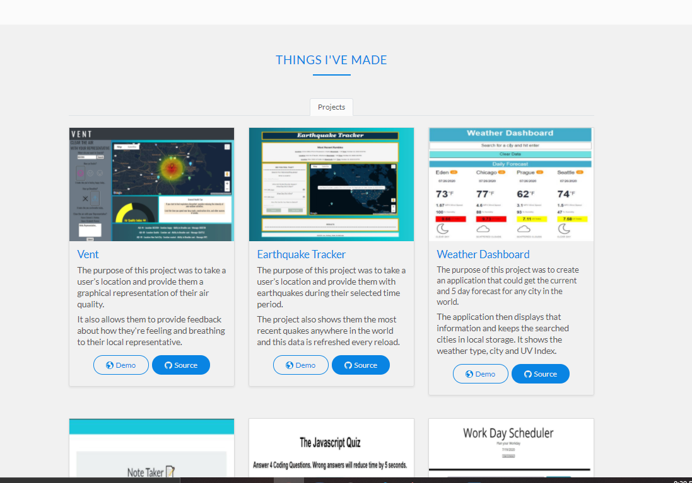

  
# Portfolio Page

## Description 
The purpose of this project is to create a customized portfolio to display my projects and allow people to contact me. 

## Project Demonstration
  

## Table of contents

- [Description](#description)
- [Installation](#installation)
- [Usage](#usage)
- [License](#license)
- [Contributing](#contributing)
- [Questions](#questions)
- [Repository Link](#repository)

## Installation

        N/A

## Usage

        Please navigate to > https://kj-labs.github.io/Updated_Portfolio/#

## License
MIT 

 

## Contributing

The owner of this project is KJ-Labs, you're welcome to contribute.

## Questions

- If you have any questions, please contact me on Github.
- [KJ-Labs](https://github.com/KJ-Labs)

## Repository

- [Project Repo](https://github.com/KJ-Labs/Updated_Portfolio)

## Screenshots
  

